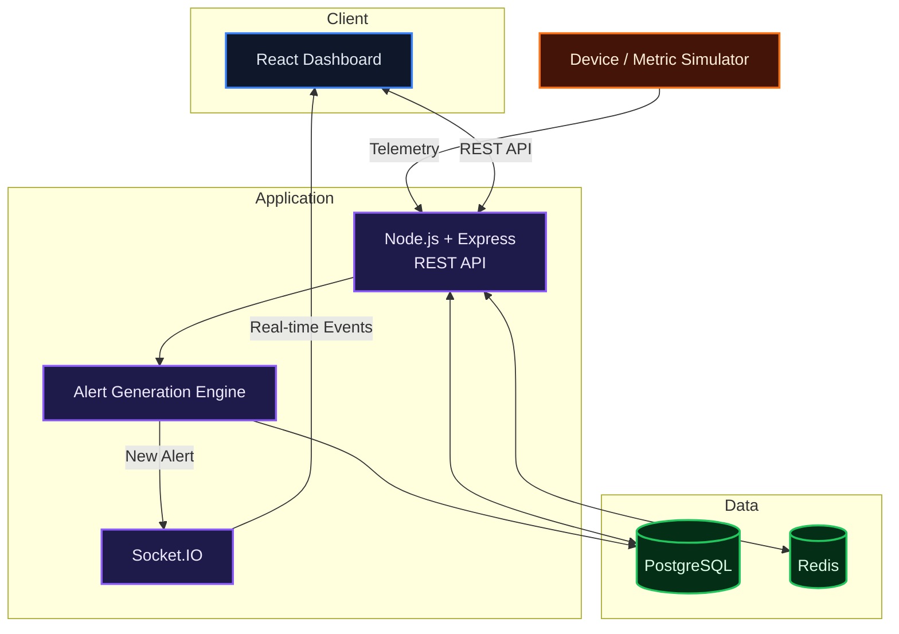
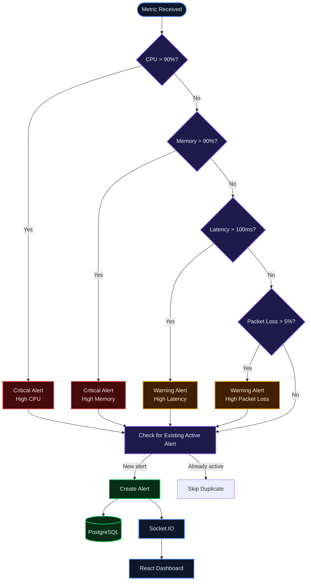
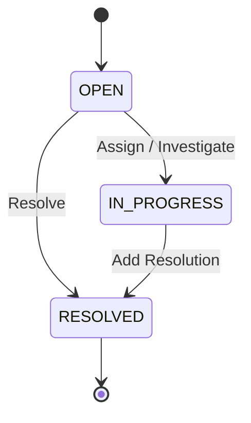
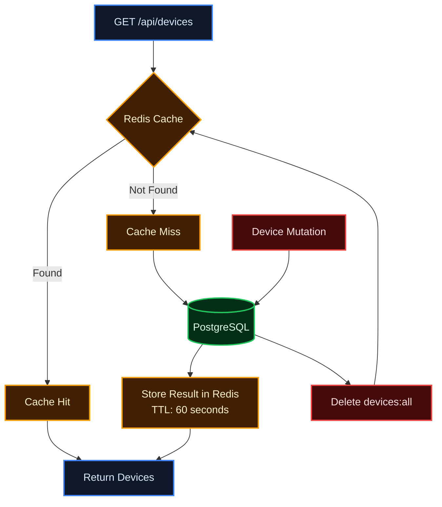
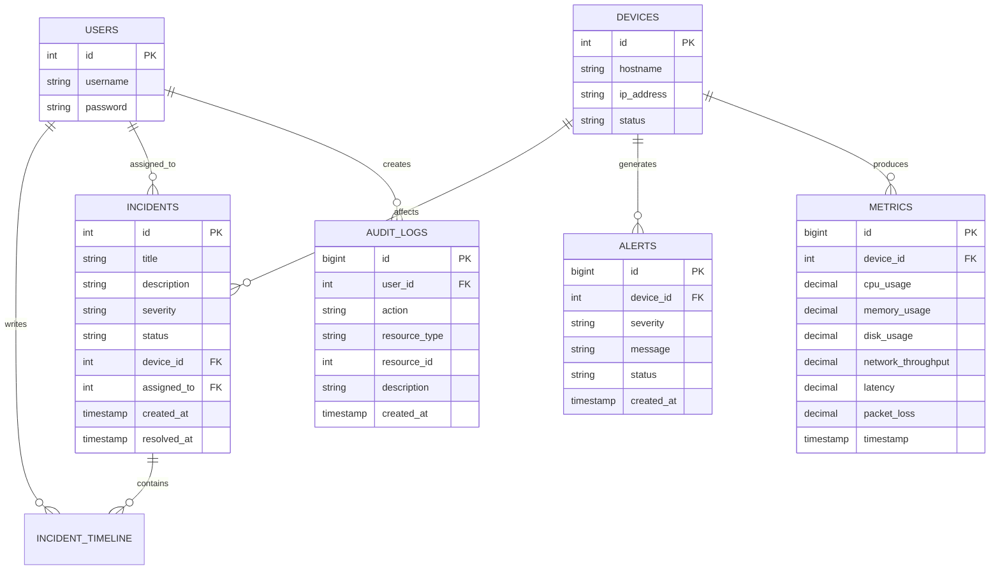
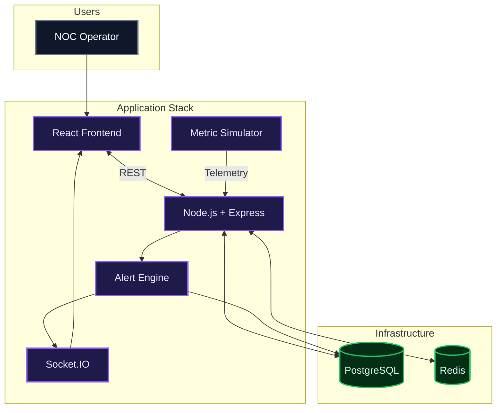

# Network Operations Center Dashboard

A real-time Network Operations Center dashboard for monitoring devices, tracking network performance, managing alerts and incidents, and keeping an audit trail of system activity.

I built this project to go beyond a typical CRUD dashboard. The goal was to understand what happens behind a monitoring system: how telemetry enters the system, how it is stored, how abnormal conditions become alerts, and how those events reach an operator in real time.

---

## Overview

The system simulates a small network environment where devices continuously produce metrics such as:

- CPU usage
- Memory usage
- Disk usage
- Network throughput
- Latency
- Packet loss

These metrics are sent to the backend and stored in PostgreSQL. An alert engine evaluates incoming metrics against predefined thresholds. When a threshold is exceeded, an alert can be generated and pushed to connected clients through Socket.IO.

Operators can then acknowledge alerts, create and manage incidents, assign incidents to users, resolve incidents, and inspect the audit history.

The project currently focuses on building the core monitoring and event flow first, with additional infrastructure and observability improvements planned.

---

## Architecture



---

## How the system works

The main flow of the application is:


This is the part of the project I wanted to get right first: the dashboard is not just displaying hardcoded values. Data is generated, processed, persisted, evaluated, and delivered to the frontend as part of an actual flow.

---

# Features

## Device Management

The dashboard maintains a device inventory containing information such as:

- Device ID
- Hostname
- IP address
- Status
- Creation time

Devices are stored in PostgreSQL and accessed through REST APIs.

The frontend provides device listing, searching, filtering, and device management operations.

---

## Network Metrics

The metrics system tracks:

| Metric | Description |
|---|---|
| CPU Usage | Current CPU utilization |
| Memory Usage | Current memory utilization |
| Disk Usage | Current disk utilization |
| Network Throughput | Network traffic in Mbps |
| Latency | Network response latency |
| Packet Loss | Percentage of lost packets |
| Timestamp | Time at which the metric was collected |

The metrics page provides summary statistics and time-series visualizations using Recharts.

---

## Device and Metric Simulator

Since the project does not depend on physical network hardware, I built a small simulator that behaves like a collection of network devices.

The simulator:

1. Fetches the available devices.
2. Generates telemetry for each device.
3. Sends the metrics to the backend.
4. Repeats the process periodically.

A typical metric looks like:

```json
{
  "device_id": 14,
  "cpu_usage": 46.3,
  "memory_usage": 42.62,
  "disk_usage": 54.15,
  "network_throughput": 82.67,
  "latency": 35.19,
  "packet_loss": 0.43
}
```

This makes it possible to test the monitoring and alerting pipeline continuously without requiring actual network equipment.

---

# Alert Generation

The backend evaluates incoming metrics against predefined thresholds.

Current examples include:

```text
CPU > 90%
    → CRITICAL

Memory > 90%
    → CRITICAL

Latency > 100 ms
    → WARNING

Packet Loss > 5%
    → WARNING
```

The alert engine checks whether an equivalent active alert already exists before creating another one.

This prevents the simulator from producing hundreds of identical active alerts while a device remains in a bad state.



---

# Real-Time Updates with Socket.IO

The system uses Socket.IO to push events from the backend to connected frontend clients.

Without real-time communication:

```text
Metric
  ↓
Alert
  ↓
Database
  ↓
User refreshes page
  ↓
Alert appears
```

With Socket.IO:

```text
Metric
  ↓
Alert
  ↓
Database
  ↓
Socket.IO
  ↓
React
  ↓
Alert appears immediately
```

This is currently used for real-time alert updates and recent-alert updates on the dashboard.

---

# Incident Management

Alerts and incidents are treated as different concepts.

An **alert** represents a detected abnormal condition.

An **incident** represents an operational issue that requires investigation or action.

The incident system supports:

- Incident search
- Severity filtering
- Status filtering
- Incident details
- Assignment
- Resolution
- Resolution descriptions
- Incident timeline/comments through the backend API

The current incident lifecycle is:



This separation makes it possible for multiple alerts to exist without necessarily turning every alert into a separate incident.

---

# Audit Logs

The system also maintains an audit trail for important actions.

An audit record can contain:

- User
- Action
- Resource type
- Resource ID
- Description
- IP address
- Timestamp

The current database contains audit logs for tracking system activity, while the frontend provides an activity history view.

This is particularly useful in an operations environment where it is important to understand not only what happened, but also which user performed an action.

---

# Redis Caching

Redis is currently used to cache the device list.

The implementation uses a cache key:

```text
devices:all
```

with a short TTL.

The read flow is:



The cache is invalidated whenever a device is created or updated.

This gives the API a simple read-through caching pattern while keeping PostgreSQL as the source of truth.

---

# Database Design

PostgreSQL is the persistent source of truth for the application.

The current schema contains:

```text
users
devices
metrics
alerts
incidents
incident_timeline
audit_logs
refresh_tokens
```

The main relationships can be thought of as:



PostgreSQL foreign keys are used to maintain relationships between devices, metrics, alerts, incidents, users, and audit records.

---

# API Overview

## Devices

```text
GET    /api/devices
GET    /api/devices/:id
POST   /api/devices
PUT    /api/devices/:id
DELETE /api/devices/:id
```

## Metrics

```text
GET  /api/metrics
GET  /api/metrics/:id
POST /api/metrics
```

## Alerts

```text
GET  /api/alerts
GET  /api/alerts/:id
POST /api/alerts
PUT  /api/alerts/:id

POST /api/alerts/:id/acknowledge
```

## Incidents

```text
GET    /api/incidents
GET    /api/incidents/:id
POST   /api/incidents
PUT    /api/incidents/:id
DELETE /api/incidents/:id

POST /api/incidents/:id/assign
POST /api/incidents/:id/resolve
POST /api/incidents/:id/comments
```

## Audit Logs

```text
GET  /api/audit-logs
GET  /api/audit-logs/:id
POST /api/audit-logs
```

---

# Project Structure

```text
NetworkOperationsCenter/
│
├── backend/
│   ├── src/
│   │   ├── config/
│   │   ├── controllers/
│   │   ├── middleware/
│   │   ├── routes/
│   │   ├── schemas/
│   │   ├── services/
│   │   ├── app.js
│   │   └── server.js
│   │
│   ├── .env
│   └── package.json
│
├── frontend/
│   ├── src/
│   │   ├── components/
│   │   ├── pages/
│   │   ├── services/
│   │   ├── types/
│   │   └── ...
│   │
│   └── package.json
│
├── simulator/
│   └── deviceSimulator.js
│
├── docker-compose.yml
│
└── README.md
```

---

# Tech Stack

| Area | Technology |
|---|---|
| Frontend | React, TypeScript, Vite |
| Charts | Recharts |
| Icons | Lucide React |
| Backend | Node.js, Express |
| Database | PostgreSQL |
| Cache | Redis |
| Real-time | Socket.IO |
| Validation | Zod |
| Authentication | JWT |
| Testing | Postman |
| Containerization | Docker, Docker Compose |
| Version Control | Git, GitHub |

---

# Running Locally

## 1. Start infrastructure

The project uses Docker Compose for PostgreSQL and Redis.

```bash
docker compose up -d
```

Check the running services:

```bash
docker compose ps
```

---

## 2. Start the backend

```bash
cd backend
npm install
npm run dev
```

The backend runs on:

```text
http://localhost:3000
```

---

## 3. Start the frontend

In another terminal:

```bash
cd frontend
npm install
npm run dev
```

The frontend runs on:

```text
http://localhost:5173
```

---

## 4. Start the simulator

In another terminal:

```bash
cd simulator
node deviceSimulator.js
```

The simulator periodically sends telemetry to the backend.

Once the simulator is running, you can watch the complete pipeline:

```text
Simulator
    ↓
Metrics API
    ↓
PostgreSQL
    ↓
Alert Engine
    ↓
Alert
    ↓
Socket.IO
    ↓
React Dashboard
```

---

# Docker

Docker Compose is currently used to manage the infrastructure dependencies.

```yaml
services:
  redis:
    image: redis:7

  postgres:
    image: postgres:16
```

Persistent volumes are used so that database and Redis data survive container restarts.

The application is being containerized incrementally rather than treating Docker as an afterthought. The current setup focuses on getting the infrastructure services running reliably before moving the application services into containers as well.

---

# What I Learned Building This

This project has been less about making a dashboard look good and more about understanding how the pieces of a real system interact.

Some of the main things I worked through were:

- Designing REST APIs around separate resources
- Separating controllers, services, validation, and database access
- Designing relational schemas with foreign keys
- Handling partial updates safely
- Validating API input with Zod
- Simulating continuous device telemetry
- Building a threshold-based alert engine
- Preventing duplicate active alerts
- Introducing Socket.IO for real-time updates
- Adding Redis caching and cache invalidation
- Maintaining an audit trail
- Managing incident lifecycles
- Moving infrastructure toward Docker Compose

The most important lesson has been that the individual technologies are not particularly interesting by themselves. The interesting part is how they work together.

---

# Current Status

### Completed

- [x] React dashboard
- [x] Device management
- [x] Metrics API
- [x] Metrics dashboard
- [x] Device/metric simulator
- [x] Alert generation engine
- [x] Alert acknowledgement
- [x] Alert resolution
- [x] Real-time alert updates
- [x] Real-time recent-alert updates
- [x] Incident management
- [x] Incident assignment
- [x] Incident resolution
- [x] Audit logs
- [x] Search and filtering
- [x] Redis device caching
- [x] Redis cache invalidation
- [x] PostgreSQL persistence
- [x] Docker Compose infrastructure

### Planned

- [ ] Automatic alert recovery
- [ ] More advanced alert deduplication
- [ ] Redis-backed distributed alert state
- [ ] More realistic metric simulation
- [ ] Complete application containerization
- [ ] Containerized simulator
- [ ] Improved authentication and authorization
- [ ] More detailed incident timelines
- [ ] Better observability
- [ ] Production deployment

---

# Future System

The longer-term architecture is to have the complete application running as a reproducible containerized system:




---

## Built by

<p align="left">
  <strong>Tamanna Rath</strong>
</p>
